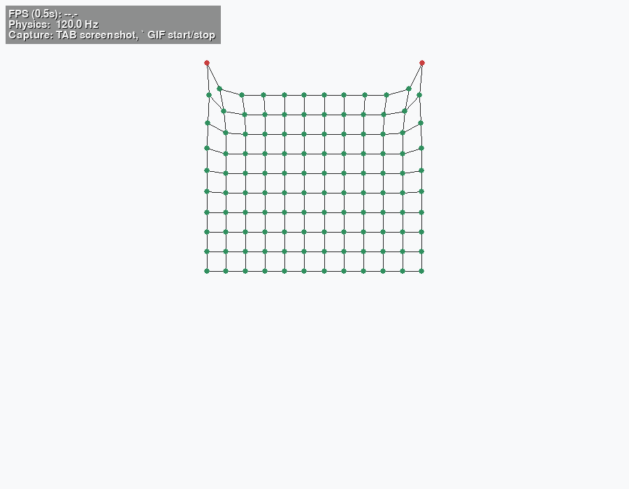
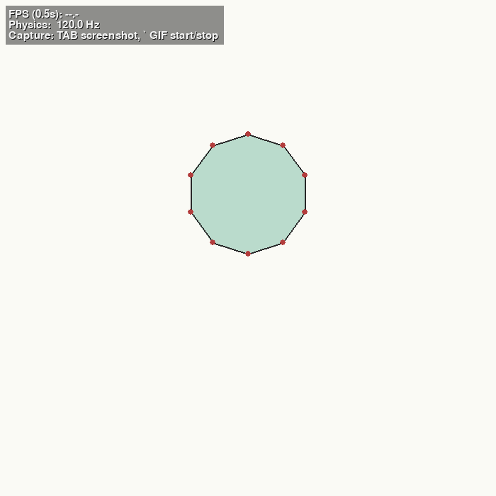
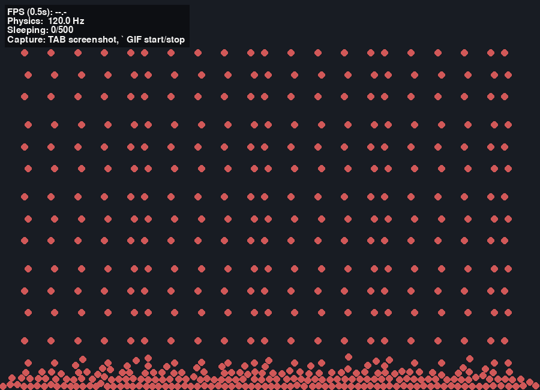

# 2D Physics Engine

A modular 2D physics engine in Python, built for the **SWGCG 352** course project.

The project follows an engine-first workflow: each physics system is developed as a standalone, runnable demo before final game integration.

## Overview

This repository focuses on:

- A reusable 2D simulation core (timing, integration, forces, collisions, constraints).
- Multiple physics modules implemented as independent demos.
- Clear progression from isolated systems to a final game that combines at least three modules.

The scope is intentionally **2D-only** to maximize stability, iteration speed, and presentation quality.

## Physics Scope

Planned module set:

1. Particle systems
2. Mass-spring systems
3. Position-Based Dynamics (PBD)
4. Rigid body dynamics
5. Forward kinematics (FK)
6. Inverse kinematics (IK)

## Current Status

| Area | Status | Notes |
|---|---|---|
| Engine core (loop, math, integrators, forces, collisions, constraints) | Implemented | Shared infrastructure in `engine/` |
| Particle system | Implemented demo | Interactive playground with runtime controls |
| Mass-spring system | Implemented demo | Spring-net cloth-like scene |
| Pressure soft body | Implemented demo | Spring + pressure model |
| Rigid bodies | Implemented demos | 2D circle collisions + Lec09 cube rotation demo |
| PBD | Planned / scaffolded | `engine/pbd.py` and `demos/pbd_demo.py` are placeholders |
| FK | Partially scaffolded | Helper logic exists in `engine/kinematics.py`; no demo scene yet |
| IK | Planned | Not implemented yet |
| Final game integration | Planned | Not started yet |

## Quick Start

### Prerequisites

- Python 3.10+ (Python 3.12 recommended)
- `pip`

### Installation

```bash
pip install -r requirements.txt
```

### Run the Demo Launcher

```bash
python main.py
```

### Run a Specific Demo

```bash
python main.py particle
python main.py spring
python main.py softbody
python main.py rigidbody
python main.py rigidbody_cube
```

You can also inspect available options:

```bash
python main.py --help
```

## Demo Media

Live capture previews from `captures/`:

<table>
  <tr>
    <td align="center">
      
    </td>
    <td align="center">
      
    </td>
  </tr>
  <tr>
    <td align="center"><em>Particle Demo: emitter, forces, and lifetime behavior.</em></td>
    <td align="center"><em>Spring Demo: mass-spring cloth-like net simulation.</em></td>
  </tr>
  <tr>
    <td align="center">
      
    </td>
    <td align="center">
      
    </td>
  </tr>
  <tr>
    <td align="center"><em>Softbody Demo: pressure + spring deformation.</em></td>
    <td align="center"><em>Rigidbody Demo: circle collisions with broadphase acceleration.</em></td>
  </tr>
</table>

Media files:

- `captures/particle_20260420_150431_638548.gif`
- `captures/spring_20260420_150012_788560.gif`
- `captures/softbody_20260420_145947_770496.gif`
- `captures/rigidbody_20260420_145913_278522.gif`

## Demo Guide

### Particle Demo (`python main.py particle`)

Highlights:

- Continuous emission and burst spawning
- Gravity, damping, drag, and wind controls
- Theme/color/draw-mode switching
- Runtime visual scaling and lifetime scaling
- Fixed-COR or randomized-COR switch via `BOUNCE_RESTITUTION` macro line

Controls:

- `LMB`: move emitter
- `X`: burst
- `Space`: pause/resume
- `R`: reset scene
- `Esc`: quit
- `E`: emitter mode
- `C`: color mode
- `V`: draw mode
- `B`: background theme
- `T`: trails toggle
- `H`: help panel toggle
- `G`: gravity toggle
- `D`: linear damping toggle
- `F`: drag toggle
- `W`: wind toggle
- `Left` / `Right`: wind strength
- `Up` / `Down`: emission rate
- `[`: visual size down
- `]` or `/`: visual size up
- `-` / `=`: lifetime scale down/up
- `P`: spawn pinned-particle mode toggle

### Spring Demo (`python main.py spring`)

- Spring-net scene using particles + springs
- `R`: reset
- `Space`: pause/resume

### Softbody Demo (`python main.py softbody`)

- Pressure-based soft body built from spring-connected particles
- `R`: reset
- `Space`: pause/resume

### Rigidbody Demo (`python main.py rigidbody`)

- Circle rigid bodies with collision response and broadphase acceleration
- Includes easy constant presets for "normal" vs "endless bouncy" behavior
- `R`: reset
- `Space`: pause/resume

### Rigid Body Cube Demo (`python main.py rigidbody_cube`)

- Lec09 rotation demo using a torque-driven wireframe cube
- Covers cube inertia, angular momentum, Newton-Euler rotation, semi-implicit integration, quaternion orientation, and rotation-matrix projection
- `Arrows`: apply torque on X/Y axes
- `Q` / `E`: apply torque on Z axis
- `R`: reset
- `Space`: pause/resume

## Architecture

### Engine Modules (`engine/`)

- `core.py`: fixed-timestep clock and world stepping
- `math2d.py`: vector math utilities
- `math3d.py`: 3D vectors, matrices, quaternions, and inertia helpers
- `integrators.py`: integration helpers
- `forces.py`: reusable force utilities (gravity, drag)
- `collisions.py`: collision detection and response helpers
- `constraints.py`: constraint utilities
- `particle.py`: particle data and stepping
- `spring.py`: spring force model
- `softbody.py`: pressure + spring soft body logic
- `rigidbody.py`: 2D and 3D rigid body primitives and stepping
- `broadphase.py`: spatial partitioning for collision candidate reduction
- `pbd.py`: PBD scaffolding
- `kinematics.py`: FK helper scaffolding
- `debug.py`: on-screen performance overlay

### Demo Modules (`demos/`)

- `particle_demo.py`
- `spring_demo.py`
- `softbody_demo.py`
- `rigidbody_demo.py`
- `rigidbody_cube_demo.py`
- `pbd_demo.py` (placeholder)
- `kinematics_demo.py` (placeholder)

## Repository Structure

```text
.
|-- main.py
|-- requirements.txt
|-- README.md
|-- PROJECT_IMPLEMENTATION_STEPS.md
|-- optimizations.md
|-- docs/
|   |-- PHYSICS_ENGINE_PIPELINE.md
|-- engine/
|   |-- broadphase.py
|   |-- collisions.py
|   |-- config.py
|   |-- constraints.py
|   |-- core.py
|   |-- debug.py
|   |-- forces.py
|   |-- integrators.py
|   |-- kinematics.py
|   |-- math3d.py
|   |-- math2d.py
|   |-- particle.py
|   |-- pbd.py
|   |-- rigidbody.py
|   |-- softbody.py
|   |-- spring.py
|-- demos/
|   |-- base_demo.py
|   |-- kinematics_demo.py
|   |-- particle_demo.py
|   |-- pbd_demo.py
|   |-- rigidbody_cube_demo.py
|   |-- rigidbody_demo.py
|   |-- softbody_demo.py
|   |-- spring_demo.py
```

## Roadmap

Next major implementation milestones:

1. Build full PBD solver + interactive PBD demo.
2. Add FK demo scene and IK solver demo scene.
3. Integrate at least three physics modules into a playable final game loop.
4. Finalize report and presentation assets with reproducible demo captures.

## Documentation

- Implementation plan: [PROJECT_IMPLEMENTATION_STEPS.md](PROJECT_IMPLEMENTATION_STEPS.md)
- Performance notes: [optimizations.md](optimizations.md)
- Pipeline notes: [docs/PHYSICS_ENGINE_PIPELINE.md](docs/PHYSICS_ENGINE_PIPELINE.md)

## Notes

- This repository is designed for educational and experimentation purposes.
- Physics constants in demos are intentionally exposed for easy tuning and comparison.
